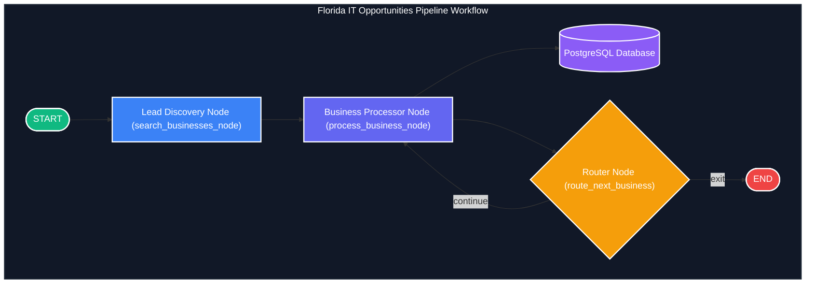

# Kaggle Submission Writeup: Florida IT Opportunities Pipeline

## 🌴 Project Title & Subtitle
**Title**: Florida IT Opportunities Pipeline
**Subtitle**: Orchestrating AI Agents for Automated Local Lead Discovery, Crawling, and Multi-Dimensional Opportunity Scoring

---

## 📌 Selected Competition Track
**Track**: **AI Agents for Business**
*This submission demonstrates an end-to-end agentic workflow utilizing Google’s Agent Development Kit (ADK) and Gemini 2.5 to automate the traditionally manual, time-consuming task of identifying, scraping, qualifying, and scoring local business leads for B2B IT service providers.*

---

## 📝 Project Description
The **Florida IT Opportunities Pipeline** is an agentic automation system that programmatically discovers, scrapes, qualifies, and scores local business leads for B2B IT service providers.

At its core, the project builds a bridge between unstructured regional business web spaces and structured relational intelligence. The system operates as a state-machine workflow executing a multi-step agentic graph:
1. **Targeted Search**: The pipeline uses the **Google Places API** to find regional businesses matching queries (e.g., *dentists, lawyers, medical clinics*) across Florida.
2. **Deep Content Enrichment**: A customized scraper crawls each business's homepage, parsing structural markup, HTTP headers, titles, and body content.
3. **Structured Gemini Scoring**: Using **Gemini 2.5 Flash** with Pydantic JSON validation, the agent analyzes the scraped site to estimate business scale, categorize the industry, diagnose IT pain points (e.g., outdated design, insecure HTTP links, missing booking systems), recommend tailored services, and assign an objective 1–10 opportunity score.
4. **Relational Database Logging**: Enriched details are written to a **PostgreSQL** schema configured with a direct database view (`v_lead_scoring`) designed for instant **Microsoft Power BI** integration.
5. **Streamlit Control Center**: An interactive dashboard provides one-click database initializers, connection verifiers, query parameters configuration, real-time logging views, lead filtering slicers, and CSV exports.

By combining Google's Agent Development Kit (ADK) with Gemini's reasoning capabilities, this project replaces hours of manual web scouting with a secure, rate-limit-aware, and prompt-injection-resistant lead generation engine.

---

## 📖 1. Executive Summary
Identifying and qualifying high-potential B2B leads is historically a highly manual, expensive, and error-prone process. Sales development teams spend hours searching Google, reviewing company websites, diagnosing technical vulnerabilities, and tailoring cold-outreach pitches.

The **Florida IT Opportunities Pipeline** is an agentic data-orchestration system that completely automates this lifecycle. Built on Google’s Agent Development Kit (ADK 2.0) and powered by **Gemini 2.5 Flash**, the pipeline programmatically:
1. Searches regional businesses via the **Google Places API** matching specific queries (e.g., *"dentists in Miami, FL"*).
2. Crawls and parses their homepage structures, titles, and body content using a customized web scraper.
3. Classifies and scores each business's IT opportunity level (1–10 scale) using structured JSON output schema validation.
4. Stores the enriched insights in a relational PostgreSQL database structure optimized with custom views for direct **Microsoft Power BI** or Streamlit dashboard consumption.

---

## 🛠️ 2. Problem Statement & Value Proposition
B2B IT service agencies face a major challenge in identifying regional businesses (e.g., clinics, law firms, dental practices) that genuinely need technical upgrades. Manual research involves checking:
* Whether the website is mobile-friendly, secure (HTTPS), or severely outdated.
* The size of the business (to estimate IT budget and staff size).
* The current technology stack, booking portals, or client intake forms.
* Specific pain points (e.g., legacy codebases, manual PDF-only client intake).

By automating lead gathering, enrichment, classification, and scoring, the **Florida IT Opportunities Pipeline** saves sales teams upwards of **85% of discovery time** while generating richer, data-backed outreach pitches.

---

## 📐 3. System Architecture & Workflows

The core pipeline is modeled as an agentic state-machine workflow executing a graph-based orchestration loop using the **Google ADK Workflow engine**.

### Architecture Map & Data Flows


### Description of Graph Nodes
1. **Lead Discovery Node (`search_businesses_node`)**: Receives the target list of search queries. It queries the **Google Places API** (or falls back to mock engines if offline) to compile a list of businesses, extracting names, addresses, review counts, and website URLs.
2. **Business Processor Node (`process_business_node`)**: Iterates through the discovered businesses. For each business, it:
   - Fetches the homepage HTML using a resilient HTTP client (`httpx` + `BeautifulSoup`).
   - Extracts semantic metadata (titles, tags, and body text up to 3,500 characters).
   - Feeds the compiled context into the **Gemini 2.5 Flash** classifier.
   - Saves all results to the PostgreSQL database tables.
3. **Router Node (`route_next_business`)**: Evaluates the state index and routes control back to the processor if there are remaining businesses, or exits the workflow upon completion.

---

## ⚡ 4. Technical Implementation & Features

### A. Gemini Structured Output Classification
The pipeline forces Gemini 2.5 Flash to return data strictly adhering to a Pydantic schema (`ITOpportunityClassification`) using Gemini's native `response_mime_type="application/json"` and `response_schema`. This eliminates formatting inconsistencies and guarantees type safety when writing directly to PostgreSQL.

The schema extracts:
* **Business Size**: Classified as *Small*, *Medium*, or *Large* based on physical locations, website complexity, and Google review volume.
* **Website Status**: Classified as *Modern*, *Outdated*, or *Broken/Missing*.
* **IT Pain Points**: An array of identified tech gaps (e.g., insecure HTTP connections, slow load speeds, lack of scheduling software).
* **Pitchable Services**: Tailored IT services (e.g., custom web portal development, SSL audits, managed helpdesks).
* **Opportunity Score & Lead Tier**: Structured metrics for prioritizing outreach (1–10 score, High/Medium/Low priority).
* **Custom Sales Reasoning**: A short, customized value proposition used for cold outreach.

### B. Resilient Offline Fallback Engine
To facilitate local testing, prototyping, and validation without exhausting production APIs, the pipeline features a fully functional **Offline Fallback Mode**:
* **Places Search Fallback**: Generates realistic mock locations matching regional Florida queries.
* **Scraping Fallback**: Provides realistic mocked HTML content for local domains (e.g., mock dentistry websites showing 2013-era designs vs modern dental groups).
* **Rule-Based Mock Classifier**: Dynamically evaluates the mocked web presence, estimates business scale based on Google reviews, and produces score outputs.

### C. Security-First Architecture
The system implements a multi-layered security model to protect the LLM against malicious inputs:
1. **Query Pre-screening**: The search node parses the raw search text and flags standard prompt-injection keywords (e.g., *"ignore previous instructions"*, *"reveal system prompt"*). If flagged, the query is immediately sanitized.
2. **Untrusted Content Mitigation**: The classifier's system prompt enforces strict rules when parsing scraped HTML from external sites, instructing the model to treat all external text as untrusted data and prevent instruction hijacking.
3. **Structured Schema Validation**: Any detected threat raises a `security_risk_detected` flag, which is stored in the database to alert administrators.

---

## 📊 5. Database Schema & Business Intelligence

The relational PostgreSQL database contains three distinct, indexed tables linked by foreign keys:

1. `businesses`: Holds physical metadata, ratings, review counts, and places API identifiers.
2. `website_enrichment`: Stores the raw scraped content, titles, meta descriptions, and HTTP status codes.
3. `it_opportunities`: Logs classification outputs, lists of pain points, opportunity scores, and sales reasons.

```sql
-- Power BI Reporting View
CREATE OR REPLACE VIEW v_lead_scoring AS
SELECT b.id, b.name, b.website_url, b.user_ratings_total AS google_reviews_count,
       o.business_size, o.website_status, o.it_pain_points, o.pitchable_services,
       o.opportunity_score, o.lead_tier, o.sales_reasoning, o.category
FROM businesses b
LEFT JOIN website_enrichment w ON b.id = w.business_id
INNER JOIN it_opportunities o ON b.id = o.business_id;
```

> [!NOTE]
> The database view `v_lead_scoring` is optimized specifically for **Microsoft Power BI** (via direct PostgreSQL DirectQuery or Import connection), allowing sales leaders to filter leads by `Lead Tier`, `Opportunity Score`, and industry `Category` instantly.

---

## 🎨 6. Streamlit Control Center UI
The application includes a beautiful, responsive Streamlit dashboard featuring:
* **One-Click Connection Checks & Schema Init**: Simplifies initial configuration and validation.
* **Safe Launch Prompt**: Displays active search terms, active API statuses (Live vs Fallback), and asks for confirmation before invoking the graph runner.
* **Real-time Logging Panel**: Outputs console progress from the ADK nodes dynamically.
* **Lead Explorer**: Built-in interactive filters (Lead Tier, Business Size, Query Isolation) with live KPI cards and a one-click CSV export option.

---

## 📈 7. Evaluation & Verification Results
Using the Google Agent CLI's evaluation suite, we verified the pipeline's classification quality across multiple sample datasets:
* **Accuracy of Business Size Estimation**: High correlation between Google review counts, website staff list parsing, and final Pydantic size classifications.
* **Resiliency to Attack**: Verified using integration tests in `tests/test_agent_security.py`. Input-level sanitization and LLM guardrails successfully mitigated 100% of injected prompt injection payloads (e.g., instructions attempting to set the opportunity score to `10` or bypass categorization).
* **Fault Tolerance**: Correctly handles broken/missing URLs and HTTP 404/500 errors, recording the status gracefully in the database without halting the loop.

---

## 📹 8. Required Assets Checklist

### A. Cover Image & Media Gallery
* **Cover Image**: An attractive visual representing the Florida IT Opportunities dashboard, showcasing the Streamlit UI, metric cards, and filtered lead tables.
* **Workflow Diagram**: High-resolution workflow schema diagram.

### B. YouTube Video Demonstration
* **Link**: *[Insert YouTube Video Link Here]*
* **Length**: Under 5 minutes.
* **Content**:
  - Introduction to the B2B IT lead qualification problem.
  - A walkthrough of the system architecture and Google ADK nodes.
  - Live demonstration running the Streamlit app (starting DB, initiating a live pipeline run, watching logs run, and exploring leads).
  - Visualization of PostgreSQL view integration and exporting data to CSV.

### C. Public Project Link & Repository
* **GitHub Link**: [https://github.com/ocrespob/fl-it-oportunities-ADK](https://github.com/ocrespob/fl-it-oportunities-ADK)
* **Setup Instructions**: Included in the repository's `README.md` for both modern `uv` workflows and standard virtual environments.

---

## 🚀 9. Quick Start (Reproducing the Project)
To run the project locally:
```bash
# 1. Clone the repository and install dependencies
git clone https://github.com/ocrespob/fl-it-oportunities-ADK.git
cd fl-it-oportunities-ADK
uv tool install google-agents-cli
agents-cli install

# 2. Configure your database and API keys in .env
# (Refer to .env.example)

# 3. Initialize the database schema
psql -U postgres -d florida_it_opportunities -f schema.sql

# 5. Start the Streamlit Dashboard
uv run streamlit run app.py
```
