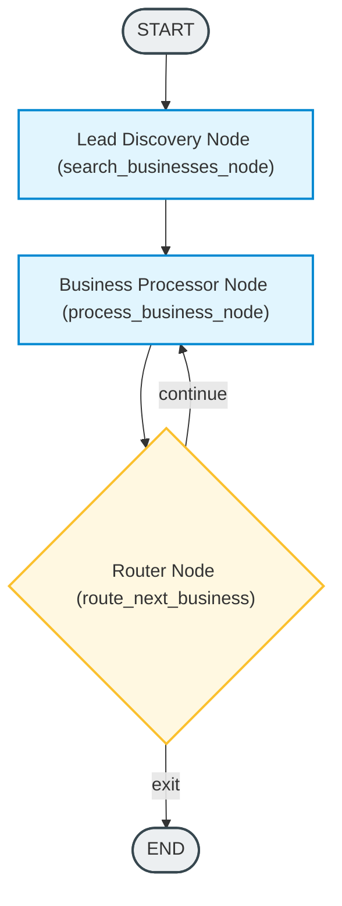

# fl-it-oportunities-ADK

## What is this project?

🌴 **Florida IT Opportunities Pipeline**  
An agentic lead qualification pipeline built with Google's Agent Development Kit (ADK) that discovers, scrapes, and classifies IT opportunities for Florida businesses.

The pipeline discovery workflow integrates with a local PostgreSQL database and is optimized to connect directly with Microsoft Power BI for deep business intelligence analysis.

```
fl-it-opportunities-agent/
├── app/                      # Core agent logic, classifier, scraper, and DB helpers
│   ├── app_utils/            # Agent helper and utility services
│   ├── agent.py              # Main agent workflow graph and nodes
│   ├── classifier.py         # Gemini IT opportunity classification
│   ├── database.py           # PostgreSQL CRUD operations
│   ├── fast_api_app.py       # FastAPI backend server
│   ├── places_search.py      # Google Places API integration
│   └── scraper.py            # Website crawler and content extractor
├── tests/                    # Unit and integration test suites
├── schema.sql                # PostgreSQL database schema & Power BI reporting view
├── pyproject.toml            # Project dependencies and configs
└── AGENTS.md                 # Agent-assisted coding guidelines
```

---

## Why was it created?

Identifying and qualifying high-potential IT service leads is historically a tedious, manual chore. Sales teams spend hours searching Google, scanning websites, estimating company sizes, diagnosing outdated sites, and determining technical needs. 

This project was created to automate the entire process:
1. **Automated Search**: Programmatically queries Google Places API to find regional businesses.
2. **Context Enrichment**: Scrapes each target's website to gather title, meta description, and page body.
3. **AI-Driven Assessment**: Uses the **Gemini LLM** to estimate business scale, categorize business types, pinpoint IT pain points, recommend pitchable services, and assign a structured `Opportunity Score` (1-10) and `Lead Tier`.
4. **Interactive Dashboarding**: Stores all insights in a structured PostgreSQL database exposed via a clean SQL view (`v_lead_scoring`) designed to directly power Microsoft Power BI reports.

---

## Architecture & Workflow

The pipeline is modeled as an agentic state-machine workflow executing the following loop:



### Workflow Stages:
* **Lead Discovery (Search Node)**: Uses the new Google Places API to search for businesses matching defined queries (e.g. `"dentists in Miami, FL"`, `"lawyers in Tampa, FL"`). Includes automated prompt injection detection.
* **Website Scraper (Process Node)**: Downloads and parses the business homepage content to inspect structure, HTTP status, and text keywords.
* **Gemini Opportunity Scorer (Process Node)**: Employs Gemini (`gemini-2.5-flash`) with structured Pydantic schema validation to assess the business size (Small, Medium, Large), determine if the site is outdated, identify IT pain points, list pitchable services, and write a custom sales pitch.
* **PostgreSQL Database Storage**: Saves all structured data in three relational tables, linked through foreign key constraints to maintain strict references.

---

## 🛠️ Technology Stack

* **Orchestration**: Google ADK Workflow (StateGraph-based Graph Orchestration)
* **Model Integration**: google-genai (Official Gemini API SDK)
* **Web Scraper**: beautifulsoup4 + httpx
* **Storage**: psycopg2 + PostgreSQL Local Database
* **User Interface**: streamlit + pandas
* **BI Integration**: PostgreSQL Database Views & `v_lead_scoring` (Optimized for Power BI)

---

## ⚙️ Setup & Installation

You can set up and run the application using a standard Python `pip` environment or with the modern `uv` manager.

### Prerequisites
Make sure you have:
* Python 3.10+
* PostgreSQL 14+ running locally on your system

---

### Option A: Modern Setup (uv / Agent CLI) - Recommended

#### 1. Install dependencies using uv
```bash
uv tool install google-agents-cli
agents-cli install
```

#### 2. Database Init (Manual)
Run the schema setup script to configure tables and views:
```bash
psql -U postgres -d florida_it_opportunities -f schema.sql
```

---

### Option B: Standard Setup (pip)

#### 1. Clone & Set Up Directory
Open your terminal inside the root folder:
```bash
# Create a virtual environment
python -m venv venv

# Activate on Windows (PowerShell)
.\venv\Scripts\Activate.ps1

# Activate on macOS/Linux
source venv/bin/activate

# Install required dependencies
pip install -r requirements.txt
```

---

### Common Step: Configure Environment Variables
Copy `.env.example` into a new `.env` file in the root directory:
```env
# GCP APIs
GEMINI_API_KEY=your_gemini_api_key_here
GOOGLE_PLACES_API_KEY=your_google_places_api_key_here

# PostgreSQL Database Credentials
DB_HOST=localhost
DB_PORT=5432
DB_NAME=florida_it_opportunities
DB_USER=postgres
DB_PASSWORD=your_password_here
```

---

## 🚀 Running the Streamlit Dashboard

Start the local Streamlit server:
```bash
uv run streamlit run app.py
```
*(Or use `streamlit run app.py` if setting up with Option B)*

### Dashboard Core Features
* **Live Configuration**: Tweak database configuration parameters and test your PostgreSQL connection directly from the sidebar.
* **Database Init**: Click **Init DB** in the sidebar to run the `schema.sql` setup script and create tables and reporting views automatically.
* **Safe Launch Confirmation**: A details window presents the active search queries and API statuses (Live/Offline Fallback) for confirmation before triggering the workflow.
* **Live Progress Logging**: Real-time logging outputs show active scraping status, Gemini responses, and rate limit schedules under a unified panel.
* **Query Isolation View**: The Lead Explorer only loads and displays data matching the current active run queries, preventing mixing historical results (e.g. dentists, warehouses) unless requested.
* **Dynamic Slicers**: Slicers for Lead Tier, Business Size, and Search Query instantly filter the KPI cards and lead data table.
* **One-Click CSV Export**: Download the current active dataset as a CSV file to feed reports manually.

---

## 🗄️ PostgreSQL Schema & Views

The database contains three main relational tables:
1. `businesses`: Holds metadata, contact numbers, and Google Place rankings.
2. `website_enrichment`: Holds the raw HTML headings, meta description, and page body.
3. `it_opportunities`: Holds the classification output, including ratings, pain points, and recommended services.

A pre-constructed view `v_lead_scoring` joins these tables automatically, exposing structured arrays and scores directly to BI reporting tools.

---

## 📊 Connecting to Power BI

### Option 1: Direct Database Connection (Recommended)
1. Open Power BI Desktop.
2. Click **Get Data** -> **PostgreSQL database**.
3. Enter the server details:
   * **Server**: `localhost` (or database host IP)
   * **Database**: `florida_it_opportunities`
4. Choose **DirectQuery** or **Import**.
5. Enter database credentials (configured in `.env`).
6. Select the view `v_lead_scoring` to load into your report model.

### Option 2: Fallback CSV Import
1. In the Streamlit UI, click the **📥 Download Lead Table as CSV** button.
2. Open Power BI Desktop.
3. Click **Get Data** -> **Text/CSV** and import the downloaded file.

---

## 🔌 Offline Fallback Mode

If no keys are provided in the environment variables, the pipeline runs in a robust Offline Fallback Mode:
* **Places Search**: Falls back to realistic mock results mapped to specific queries, or generates a dynamic generic mock result for new queries.
* **Scraper**: Provides predefined mock HTML content for offline domains to simulate scraping.
* **Classifier**: Uses a rule-based logic processor to categorize businesses, estimate sizes based on review counts, and generate tailored sales reasons.

---

## Who created it?

* **Oscar Crespo**
  * **Email**: [ocrespob@gmail.com](mailto:ocrespob@gmail.com)
  * **GitHub**: [@ocrespob](https://github.com/ocrespob)

---

## How can others contribute?

Contributions are welcome and highly appreciated! To contribute:

1. **Fork the Repository** on GitHub.
2. **Create a Feature Branch** (`git checkout -b feature/amazing-feature`).
3. **Commit Your Changes** following the [Conventional Commits](https://www.conventionalcommits.org/) specification:
   * Example: `feat(scraper): add support for parsing javascript-heavy sites`
   * Use type options such as `feat`, `fix`, `docs`, `refactor`, `chore`, or `test`.
4. **Run Code Quality Checks**:
   ```bash
   agents-cli lint
   ```
5. **Open a Pull Request** explaining your enhancements or bug fixes.
